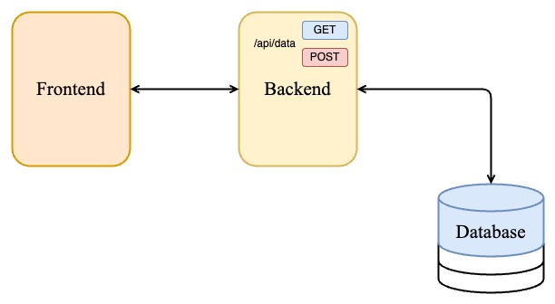
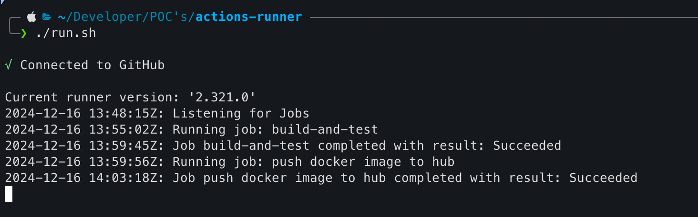

# CI-CD Pipeline with Self Hosted Runner

## System Architechture 


## Backend
- A simple backend that connect with the database (creds are in .env).
- A simple route for `GET`, `POST` from the frontent REST-API request.
- Simple `Migration` step also shown in the backend code base.
- Wrote some scripts for `wait` for **database container** ready state.
## Frontend
- A simple `html` file and a `javascript` file that is used for interacting with the backend service.
- A simple api-url condition for browser access and the internal docker access.
## Database
- used MySQL database
- ``environment`` variables are given in `.env` file
```bash
MYSQL_ROOT_PASSWORD=rootpassword
MYSQL_DATABASE=testdb
MYSQL_USER=myuser
MYSQL_PASSWORD=mypassword
MYSQL_HOST=db

```
## `docker-compose`
- **docker-compose** file contains the services configs and how to build an image from their `Dockerfile` 
- Also used the `depends` option to wait unil another service start.
- Used the wait script written in the backend service. (This is because the depends option doesn't work fine in all situation it is best to write a wait script for the services for dependency issues)

## CI-CD
- Setup the self-hosted runner for this
- Then Configure Docker-Hub As Per your need
- You have to install the needs for testing your builds in self-hosted runner
- Use github secrets for adding the credentials of Dockerhub repository
- After a successful testing then push the docker images to a Dockerhub Repository

## Logs for self-hosted github-runner
